# **KaseiCoin**
Creating a fungible  token on the Ethereum blockchain

## **Process Notes**

---

I created and deployed this project using **Remix Ethereum IDE**, **MetaMask**, and **Ganache**.

### **Initial Setup**
Using MetaMask, I created a Custom RCP network named "devNetwork" (Chain ID 1337) and used the Ganache RPC Server for the New RPC URL. I imported 3 accounts from Ganache using their private keys.

### **Deployment of Solidity Contracts in Remix IDE**
To deploy the three contracts (KaseiCoinCrowdsaleDeployer, KaseiCoinCrowdsale, and KaseiCoin, in that order), I followed these steps:

1) Environment Injected Web3
2) Select one of your imported accounts in MetaMask from Accounts dropdown, copy the address.
3) Select KaseiCoinCrowdsaleDeployer contract, enter in Token Name, Token Symbol, and copied address.
4) Transact & then confirm through MetaMask popup

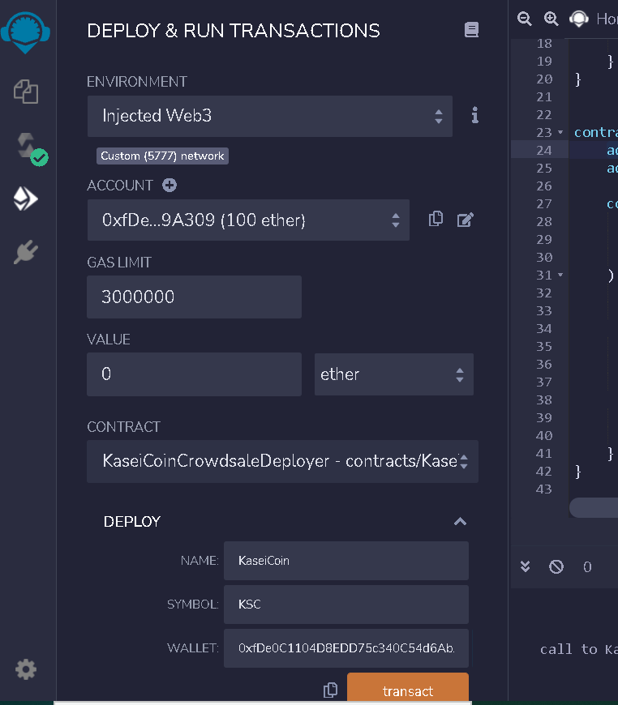

5) In the deployed KaseiCoinCrowdsaleDeployer contract, call the kasei_crowdsale_address and copy it.
6) Paste it into At Address (above deployed contracts section) and change the contract to KaseiCoinCrowdsale.
7) Execute At Address.

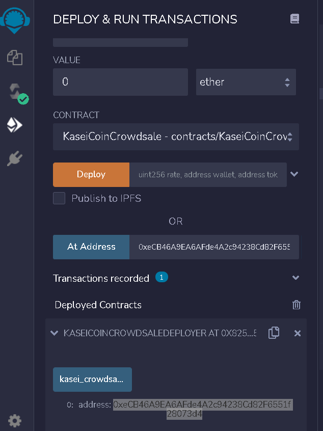

8) Follow the same steps as in 6, but use the kasei_token_address and change the contract to KaseiCoin.
9) Execute At Address.

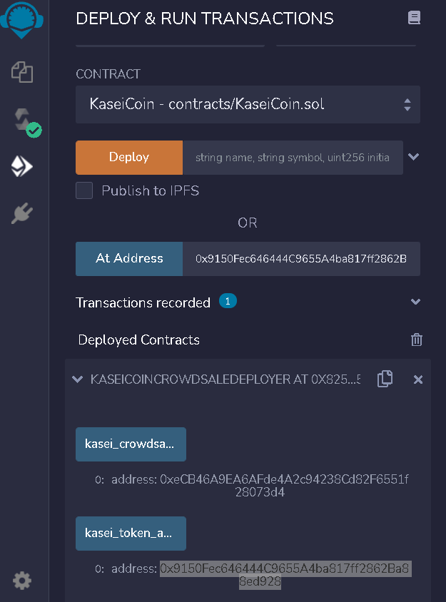

You will now be able to call the name, symbol, and totalSupply from the KaseiCoin contract.

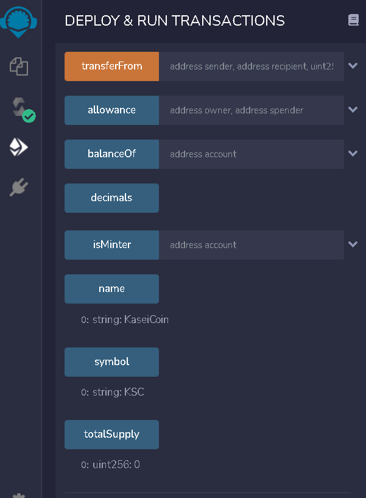

### **Transacting**

1) Paste your second public key address into the buyTokens - transact(payble) section of the KaseiCoin Crowdsale contract. At the top of the Deploy and Run Transactions section, change the value selector to "ether" and enter an amount.
2) Execute buyTokens.

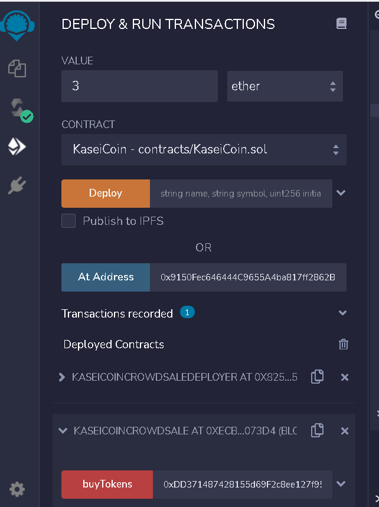

3) Confirm transaction through MetaMask popup.

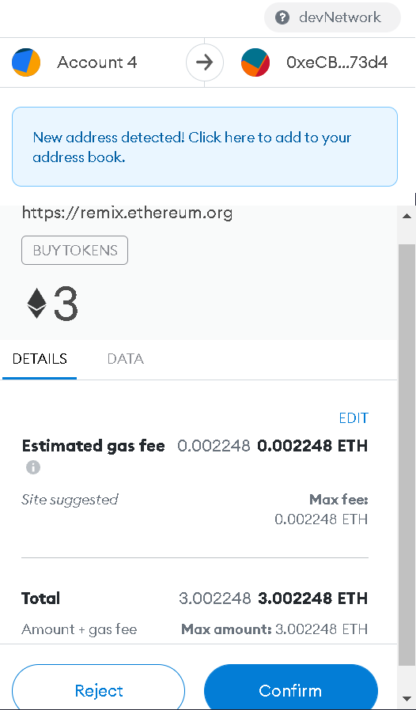

4) Check balance in the KaseiCoin contract by pasting the same public key address into the balanceOf call.

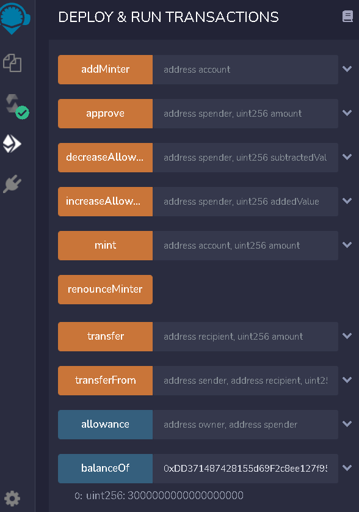

## **Evaluation Evidence**

---

Note: The images below are from an earlier test run and so the balances and addresses will be a bit different from the screenshots above.

### KaseiCoin Compilation
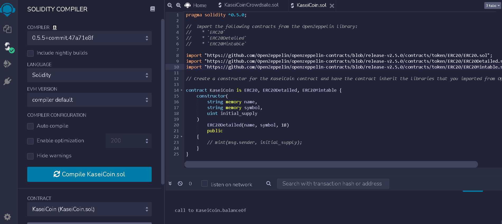

### Crowdsale Compilation
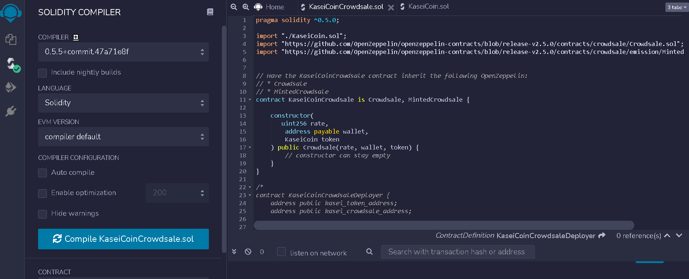

### Deployer Compilation
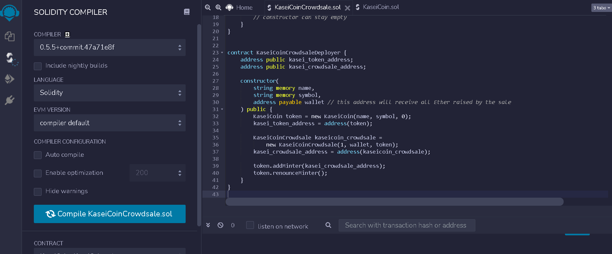

### Buy Tokens
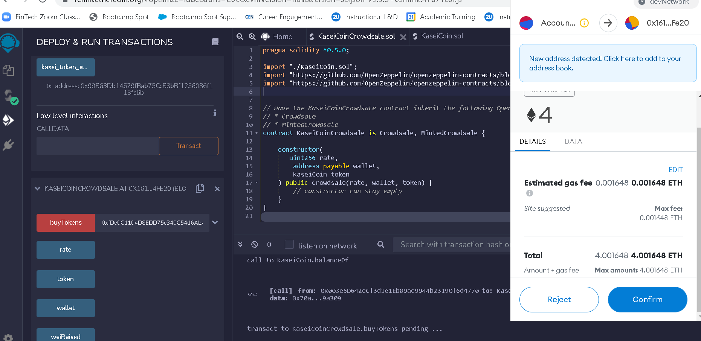

### Ganache Transactions
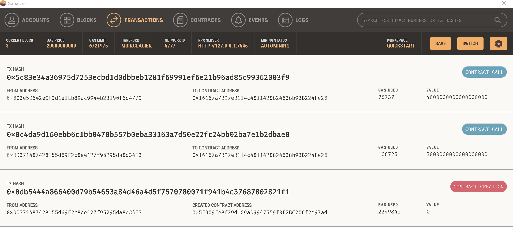

### Wei Raised
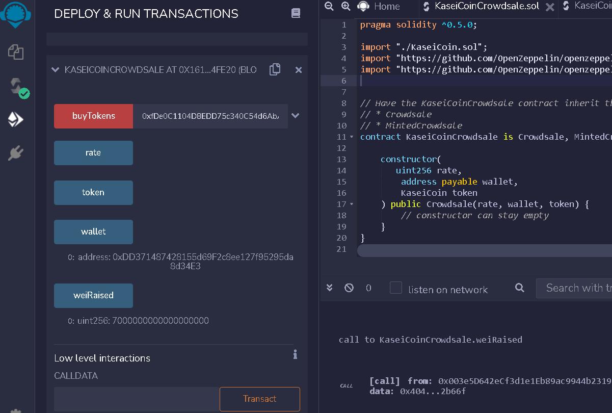

### Total Supply
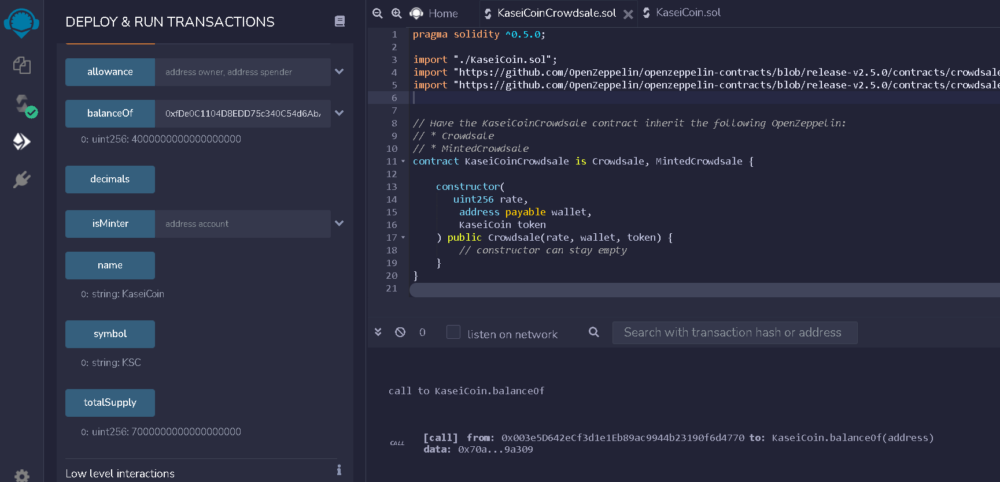

